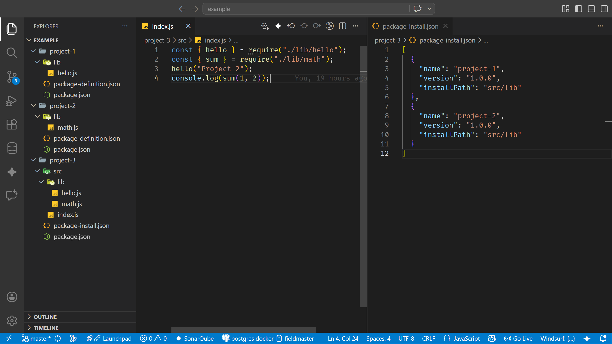

# local-packages-manager (lpm)

A versatile CLI package manager for local development. Designed to manage and distribute local packages across multiple projects using a parent-child architecture.

---

## Package System

lpm is based on two core concepts:

* **Package Definition (parent)**: defines what a package exposes
* **Package Install (child)**: defines where and how that package is installed

---

## Package Definition (Parent)

Defines a reusable local package.

File: `package-definition.json`

```json
{
  "name": "project-1",
  "version": "1.0.0",
  "sourcePath": "lib",
  "include": [
    "/**"
  ],
  "exclude": []
}
```

## Fields

* **name**: Unique package name
* **version**: Package version
* **sourcePath**: Root folder where files are taken from
* **include**: Glob patterns to include files
* **exclude**: Glob patterns to exclude files

## Behavior

* Acts as the **source of truth**
* Defines what files will be shared
* Can be consumed by multiple projects

---

## Package Install (Child)

Defines where and how a package is installed.

File: `package-install.json`

```json
[
  {
    "name": "project-1",
    "version": "1.0.0",
    "installPath": "src/lib"
  }
]
```

## Fields

* **name**: Name of the parent package
* **version**: Version to install
* **installPath**: Destination inside the project

## Behavior

* References a parent package
* Defines where files will be copied or linked
* Can install multiple packages

---

## Relationship (Parent → Child)

```txt
package-definition.json  →  package-install.json
        (source)                 (target)
```

### Flow

1. A package is defined using `package-definition.json`
2. Another project declares it in `package-install.json`
3. Running:

```bash
lpm install
```

4. lpm will:

   * Locate the parent package
   * Read its definition
   * Copy or link files from `sourcePath`
   * Respect `include` / `exclude`
   * Install them into `installPath`

---

## Example Workflow

### Step 1: Create a shared package

```bash
cd common-lib
lpm init
```

Define:

```json
{
  "name": "common-lib",
  "version": "1.0.0",
  "sourcePath": "src",
  "include": ["/**"],
  "exclude": ["**/*.test.js"]
}
```

---

### Step 2: Consume it in another project

```json
[
  {
    "name": "common-lib",
    "version": "1.0.0",
    "installPath": "src/shared"
  }
]
```

---

### Step 3: Install

```bash
lpm install
```

Result:

```txt
common-lib/src  →  project/src/shared
```

---

## Command Summary

| Command   | Alias | Description                        |
| --------- | ----- | ---------------------------------- |
| init      | —     | Create package-install.json        |
| new       | —     | Create package-definition.json     |
| package   | p     | Pack a package into local registry |
| unpackage | up    | Remove package from local registry |
| install   | i     | Install packages into workspace    |
| uninstall | ui    | Remove installed package           |
| help      | -h    | Show help                          |

---

## Notes

* `package` must be executed before `install`
* Packages are resolved from the local registry (`~/.lpm`)
* Version must match between:

  * `package-definition.json`
  * `package-install.json`

---

## Example



The image shows a typical **lpm workflow with three projects**:

* **project-1** and **project-2** act as **parent packages**

  * Each defines its exports using `package-definition.json`
  * They expose files from their `lib` folders (e.g. `hello.js`, `math.js`)

* **project-3** acts as the **consumer (child)**

  * Uses `package-install.json` to declare dependencies
  * Installs both packages into `src/lib`

---

## Benefits of This Model

* Clear separation between definition and usage
* No need to publish to npm
* Works across multiple repositories
* Full control over file distribution
* Ideal for microservices and shared codebases
